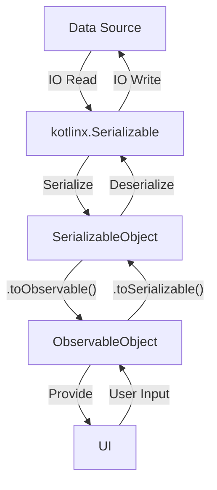

## Model Rules

All data models will have two sets of classes:

 - `Observable classes`: for UI use, the value changes will sync to surface in time
 - `Serializable classes`: for persistence, only for data exchanges from disk or network

Data flow shows to be like:

It requires that any IO operations should be done with a `SerializableObject`.

When an IO operation is required, you should create a snapshot with `.toSerializable()`.